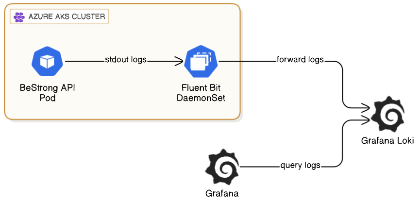

# Report 28.05.25
Setup and configure FluentBit to collect "BeStrong" API logs.,
Make the logs from FluentBit available in Grafana

## Step 1: Add Helm repositories
```
helm repo add grafana https://grafana.github.io/helm-charts
helm repo update
```
## Step 2: Install Loki + Fluent Bit + Grafana
```
helm install loki grafana/loki-stack \
  --namespace logging --create-namespace \
  --set grafana.enabled=true \
  --set prometheus.enabled=false \
  --set fluent-bit.enabled=true \
  --set loki.enabled=true
```
## Step 3: Open Grafana
```
minikube service loki-grafana -n logging
```

Username: admin
Password: ``` kubectl get secret --namespace logging loki-grafana -o jsonpath="{.data.admin-password}" | base64 --decode ; echo ```

## Step 4: Go to Explore in Grafana

Select Loki as Data Source
Start typing: ``` {job="fluent-bit"} ```

## Diagram



# ASP.NET Core WebApi Sample with HATEOAS, Versioning & Swagger

In this repository I want to give a plain starting point at how to build a WebAPI with ASP.NET Core.

This repository contains a controller which is dealing with FoodItems. You can GET/POST/PUT/PATCH and DELETE them.

Hope this helps.

See the examples here: 

## Versions

``` http://localhost:29435/swagger ```


## GET all Foods

``` http://localhost:29435/api/v1/foods ```


## GET single food

``` http://localhost:29435/api/v1/foods/2 ```


## POST a foodItem

``` http://localhost:29435/api/v1/foods ```

```javascript
  {
      "name": "Lasagne",
      "type": "Main",
      "calories": 3000,
      "created": "2017-09-16T17:50:08.1510899+02:00"
  }
```


## PUT a foodItem

``` http://localhost:29435/api/v1/foods/5 ```

``` javascript
{
    "name": "Lasagne2",
    "type": "Main",
    "calories": 3000,
    "created": "2017-09-16T17:50:08.1510899+02:00"
}
```


## PATCH a foodItem

``` http://localhost:29435/api/v1/foods/5 ```

``` javascript
[
  { "op": "replace", "path": "/name", "value": "mynewname" }
]
```


## DELETE a foodItem

``` http://localhost:29435/api/v1/foods/5 ```


